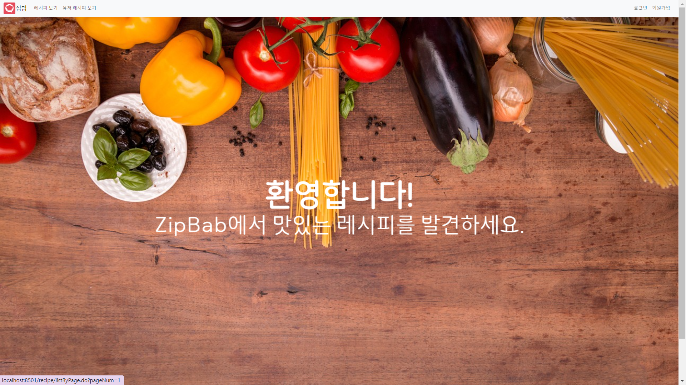
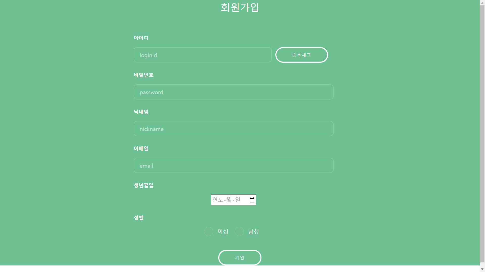
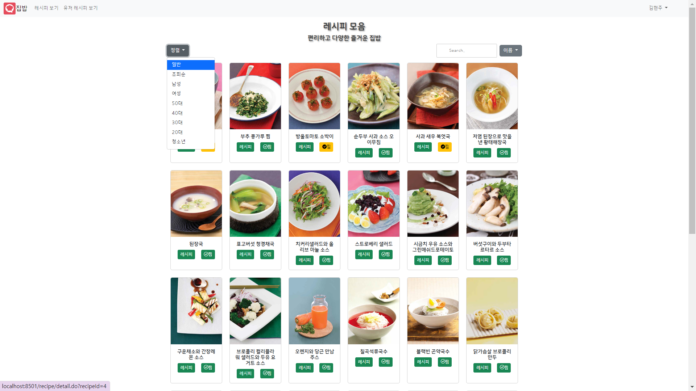
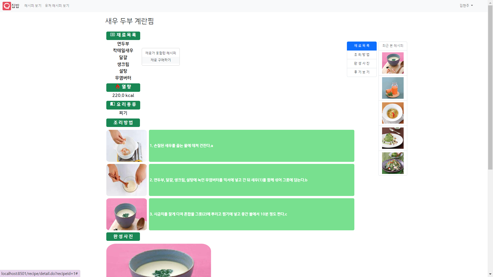
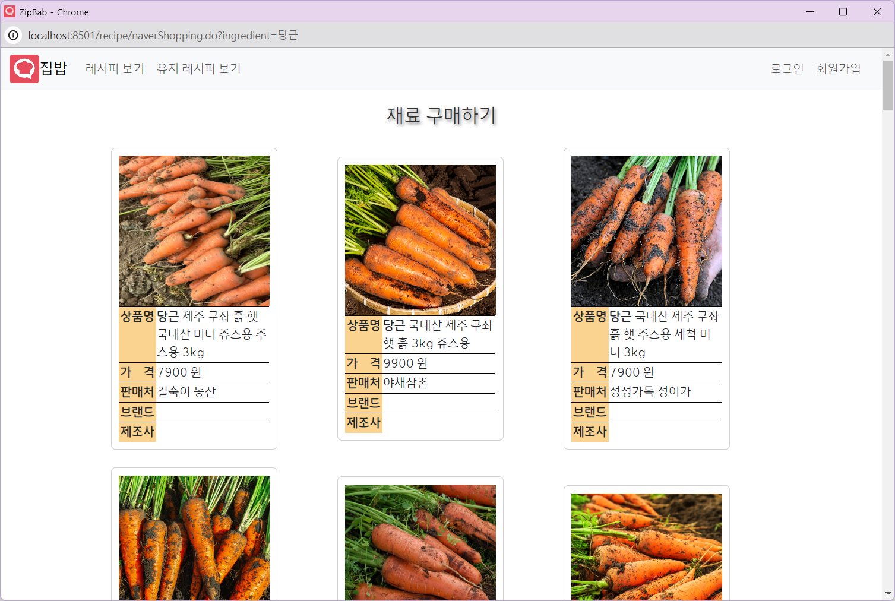
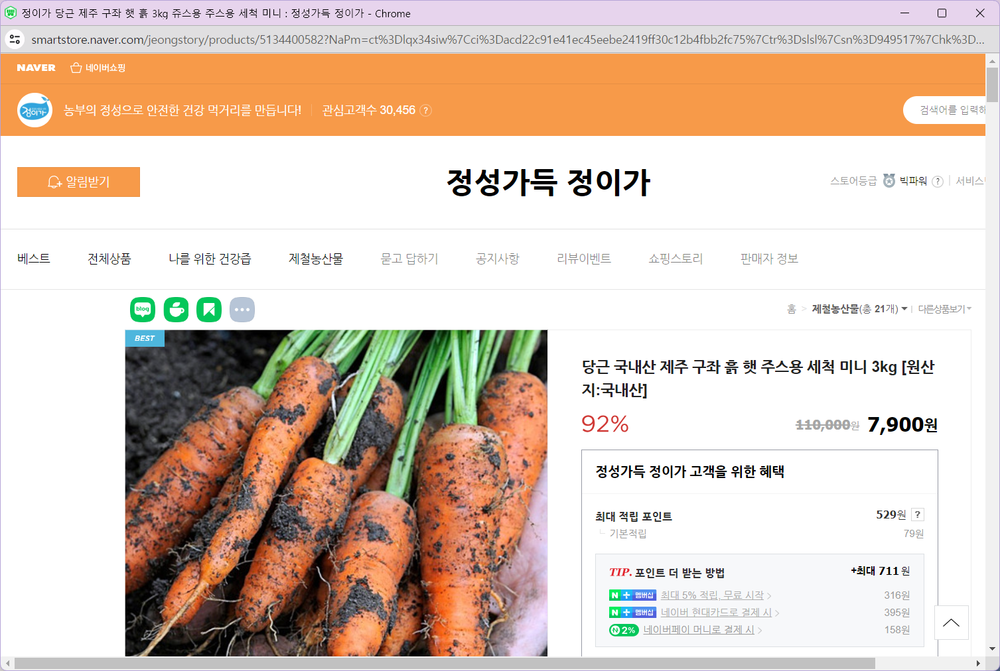
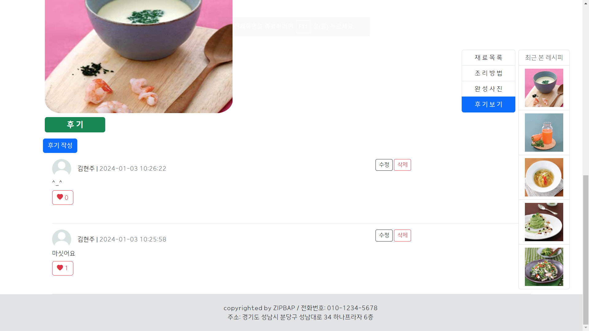
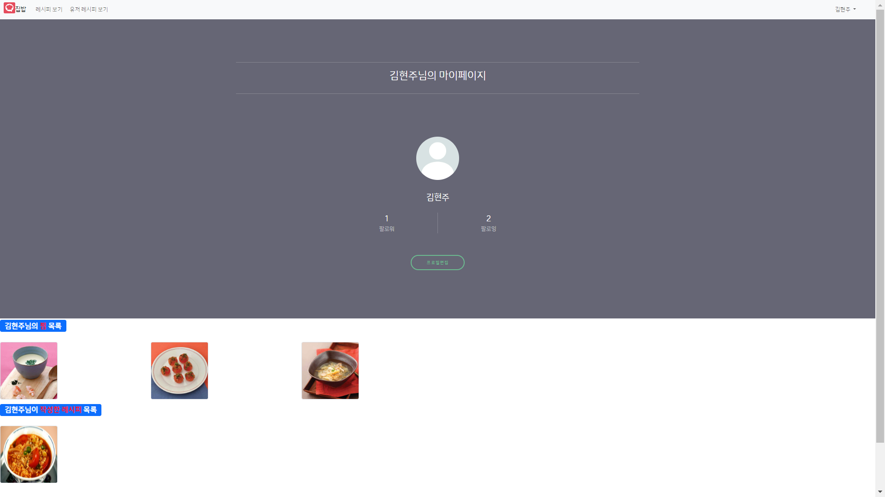
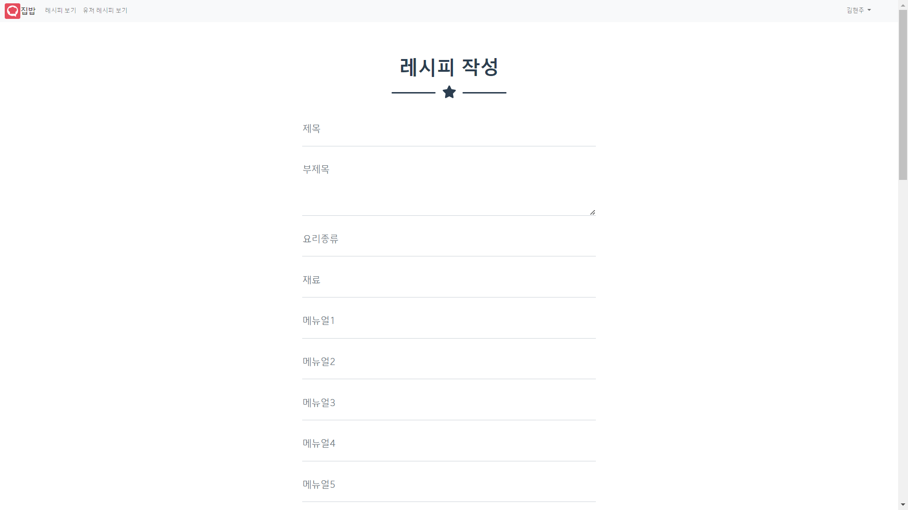

# Zip-bab

### 🍽️ 누구나 쉽게 공유하고 찾아볼 수 있는 레시피!

오늘 저녁은 뭘 먹을지 아직도 못정하셨어요??  
다른 사람이 공유한 레시피를 보고 오늘 저녁을 준비해봐요!

개발기간 : 2023.10.04 ~ 2023.10.18(2주)

## 💻 Service

<table>
   <tr>
        <td>메인화면</td>
    </tr>
    <tr>
        <td>
            
        </td>
    </tr>
    <tr>
        <td>회원가입</td>
    </tr>
    <tr>
        <td>
            
        </td>
    </tr>
    <tr>
        <td>레시피 목록</td>
    </tr>
    <tr>
        <td>
            
        </td>
    </tr>
    <tr>
        <td>레시피 상세 정보</td>
    </tr>
    <tr>
        <td>
            
        </td>
    </tr>
    <tr>
        <td>재료 구매 및 네이버 쇼핑 연동</td>
    </tr>
    <tr>
        <td>
            
            
        </td>
    </tr>
    <tr>
        <td>댓글 및 좋아요</td>
    </tr>
    <tr>
        <td>
            
        </td>
    </tr>
    <tr>
        <td>마이페이지</td>
    </tr>
    <tr>
        <td>
            
        </td>
    </tr>
    <tr>
        <td>직접 작성하는 레시피</td>
    </tr>
    <tr>
        <td>
            
        </td>
    </tr>
</table>

 

